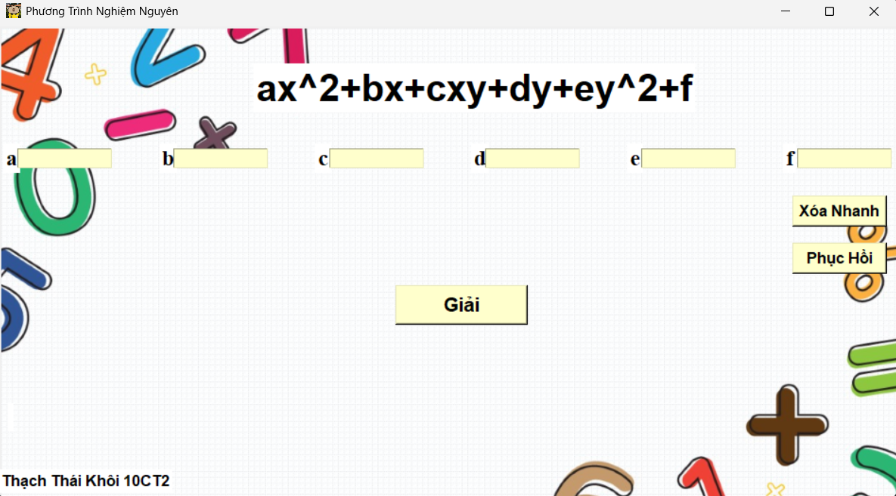

# Integer-quadratic-equation-in-two-variables-Solver
solve standard integer quadratic equation in two variables by python( my grade 10 personal project)

[Tiếng Việt](README.md) | **English**

# Integer Quadratic Equation in Two Variables Solver

A desktop application built with Python and Tkinter that finds the **integer solutions** of a two-variable quadratic equation:

```
ax² + bx + cxy + dy + ey² + f = 0
```

Enter the six coefficients and the program lists every integer pair `(x, y)` it finds.

<!-- Add a screenshot to the Images/ folder and update this path -->


---

## Features

- Input six coefficients `a, b, c, d, e, f` — empty fields are treated as `0`
- Dedicated handling for special cases: `e = 0`, and `b = c = d = 0` (the form `ax² + ey² + f = 0`)
- Displays `{Ø}` when no integer solution exists
- **Quick Clear**: empties all input fields at once
- **Restore**: brings back the last set of coefficients that was solved
- Keyboard shortcuts: `Enter` to solve, `←` `→` to move between fields

## Current Limitations

- Each coefficient must fall within `[-3000, 3000]`
- Integer coefficients only
- The search runs over a bounded range, so completeness is not guaranteed for every set of coefficients

---

## Installation and Usage

**Requirements:** Python 3.8 or later (Tkinter ships with the standard Python installer on Windows and macOS).

On Linux, install Tkinter if it is missing:

```bash
sudo apt install python3-tk
```

Run the program:

```bash
git clone https://github.com/USERNAME/Integer-quadratic-equation-in-two-variables-Solver.git
cd Integer-quadratic-equation-in-two-variables-Solver
python PhuongTrinhNghiemNguyen.py
```

> **Note:** the program loads its interface images through the relative paths `Images/bg3.png` and `Images/icon2.png`. Run the command from the directory containing the `.py` file, and keep the `Images/` folder alongside it.

No third-party libraries are used, so there is no `requirements.txt`.

## Project Structure

```
Integer-quadratic-equation-in-two-variables-Solver/
├── Images/
│   ├── bg3.png                     # Background image
│   └── icon2.png                   # Window icon
├── PhuongTrinhNghiemNguyen.py      # Full source code
├── .gitignore
├── LICENSE
├── README.md
└── README.en.md
```

## Building a Standalone .exe

```bash
pip install pyinstaller
pyinstaller --onefile --windowed --add-data "Images;Images" PhuongTrinhNghiemNguyen.py
```

The executable appears in `dist/`, which `.gitignore` excludes. To distribute a build, attach it to a GitHub **Release** rather than committing it to the repository.

## Roadmap

- [ ] Validate coefficients numerically instead of by string comparison
- [ ] Support decimal coefficients
- [ ] Show the solving steps, not just the final answer
- [ ] Plot the curve and mark the integer solution points

## License

Released under the MIT License — see [LICENSE](LICENSE).

You are free to use, modify and redistribute this source code, provided the original copyright notice and license text are kept intact.

## Author

Tika — <thaikhoi09@gmai.com>
